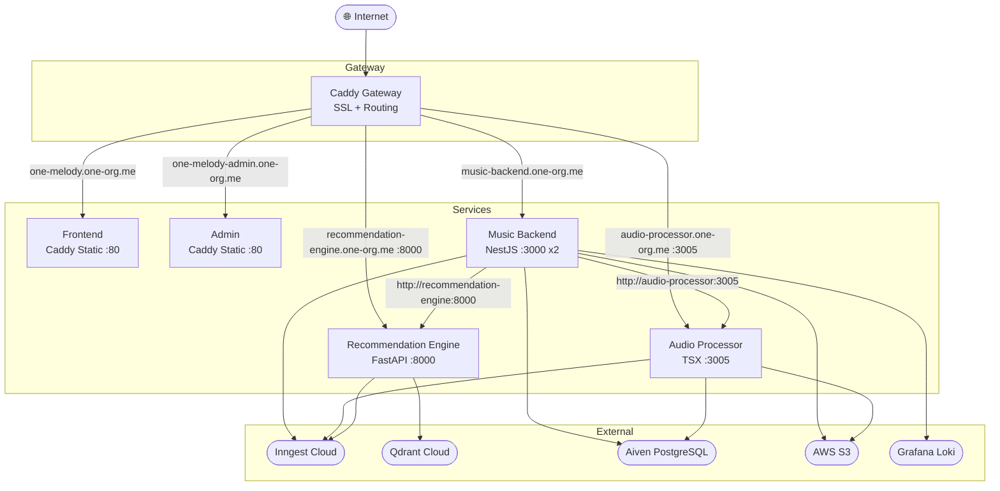

# OneMelody

OneMelody is a comprehensive music streaming ecosystem encompassing web applications, mobile applications (iOS/Android), and robust backend services handling music streaming, audio processing, and AI-driven recommendations.

## 🏗️ Architecture

The OneMelody platform relies on a distributed microservices architecture, routed via a Caddy Gateway.



---

## 📁 Repository Structure

*   **`music-backend/`**: The core API backend built with NestJS and Prisma. Responsible for user management, metadata handling, and interactions with the database and external services.
*   **`audioProcessingServer/`**: An Inngest background job processor utilizing FFmpeg for transcoding uploaded audio files and processing images.
*   **`reccomendationEngine/`**: A FastAPI service powering intelligent music discovery, leveraging vector search with Qdrant.
*   **`music-frontend-web/`**: The main user-facing web application built with React, Vite, and Shadcn UI.
*   **`music-backend-admin-web/`**: The administrative web dashboard for managing the platform, built with React and Vite.
*   **`android-app/`** & **`ios-app/`**: The cross-platform mobile applications built using React Native and Expo.

---

## 🗄️ Storage Keys & S3 Structure

OneMelody handles user uploads securely via an initial "Temp" bucket before asynchronously processing (transcoding/resizing) and moving files to a "Production" bucket for high-speed delivery.

### 1. Songs

Songs require separate workflows for the audio bitstream and the cover image.

**Database Record:**
*   `id`: `<songUuid>`
*   `storageKey`: `songs/<jobId>` (The core prefix returned by the processor)

*   **Temp Upload (Before Processing)**
    *   Audio: `s3://onemelodytemp/<uuid>-<filename.mp3>`
    *   Cover Image: `s3://onemelodytemp/<uuid>-<filename.png>`
*   **Production Storage (After Processing)**
    *   Audio Files (HLS streaming):
        *   `s3://onemelodyproduction/songs/<jobId>/master.m3u8`
        *   `s3://onemelodyproduction/songs/<jobId>/32k/...`
        *   `s3://onemelodyproduction/songs/<jobId>/64k/...`
        *   `s3://onemelodyproduction/songs/<jobId>/128k/...`
    *   Cover Images:
        *   `s3://onemelodyproduction/song-cover-images/<jobId>/cover/original.png`
        *   `s3://onemelodyproduction/song-cover-images/<jobId>/cover/small.webp`
        *   `s3://onemelodyproduction/song-cover-images/<jobId>/cover/medium.webp`
        *   `s3://onemelodyproduction/song-cover-images/<jobId>/cover/large.webp`

> **Note for Frontend:** To display a song cover image, use the DB `storageKey` (e.g., `songs/<jobId>`), change the prefix to `song-cover-images/`, and append `/cover/small.webp`.

### 2. Artists & Playlists

Both Artists and Playlists follow similar structures, utilizing both a cover image (avatar) and a banner image.

*   **Artist DB Record:** `id: <artistUuid>`, `storageKey: artists/<jobId>`
*   **Playlist DB Record:** `id: <playlistUuid>`, `storageKey: playlists/<jobId>`

*   **Temp Upload (Before Processing)**
    *   Cover Image: `s3://onemelodytemp/<uuid>-<filename.png>`
    *   Banner Image: `s3://onemelodytemp/<uuid>-<filename.png>`
*   **Production Storage (After Processing)**
    *   Cover Images (e.g., Artists):
        *   `s3://onemelodyproduction/artists/<jobId>/cover/original.png`
        *   `s3://onemelodyproduction/artists/<jobId>/cover/small.webp` (etc.)
    *   Banner Images (e.g., Artists):
        *   `s3://onemelodyproduction/artists/<jobId>/banner/original.png`
        *   `s3://onemelodyproduction/artists/<jobId>/banner/small.webp` (etc.)
    *   *Note: Playlists mirror this structure under the `playlists/` prefix.*

---

## 🛠️ Local Development & Build Instructions

Ensure you have Node.js 20+ and Python 3.12+ installed. 

### Core Backend Services

**`music-backend/`**
*   **Toolchain**: Node 20, `pnpm` (Corepack)
*   **Setup**: 
    ```bash
    cd music-backend
    corepack enable pnpm
    pnpm install
    npx prisma generate
    ```
*   **Development**: `pnpm run dev`
*   **Inngest Dev**: `pnpm run inngest`
*   **Build**: `pnpm run build`

**`audioProcessingServer/`**
*   **Toolchain**: Node 20, `pnpm`, `ffmpeg` (Required locally)
*   **Setup**:
    ```bash
    cd audioProcessingServer
    corepack enable pnpm
    pnpm install
    npx prisma generate
    ```
*   **Development**: `pnpm run dev`

**`reccomendationEngine/`**
*   **Toolchain**: Python 3.12, `uv`
*   **Setup**:
    ```bash
    cd reccomendationEngine
    uv sync
    ```
*   **Development**: `uv run uvicorn main:app --host 0.0.0.0 --port 8000`

### Web Frontends

Both the Main Web App (`music-frontend-web/`) and Admin Dashboard (`music-backend-admin-web/`) follow identical Vite + React workflows.

*   **Toolchain**: Node 20, `pnpm`, Vite
*   **Setup**:
    ```bash
    cd music-frontend-web # or music-backend-admin-web
    pnpm install
    ```
*   **Development**: `pnpm run dev`
*   **Build**: `pnpm run build`

### Mobile Apps

Both iOS and Android apps utilize React Native via Expo.

*   **Toolchain**: Node 20, `npm`, Expo CLI
*   **Setup**:
    ```bash
    cd android-app # or ios-app
    npm install
    ```
*   **Development**: 
    *   `npm run android` 
    *   `npm run ios` 
    *   `npm run start` (for general Expo bundler)

---

## 🚀 Production Deployment

OneMelody leverages Docker Compose for local full-stack evaluation and production deployment. The architecture operates entirely behind a Caddy reverse proxy handling Automatic HTTPS and routing.

1. Ensure all `.env` files are populated in their respective service folders (`music-backend`, `audioProcessingServer`, `reccomendationEngine`).
2. Ensure you have the `Caddyfile` configured in the root directory.
3. Deploy the network using Docker Swarm / Compose (as defined in `docker-compose.yml`):

```bash
docker compose up -d
```

### Production Topology Details:
*   **Caddy** maps root domains (e.g., `one-melody.one-org.me`, `music-backend.one-org.me`) to internal Docker network aliases.
*   **Backend** operates with 2 Replicas, pointing directly to shared databases (Postgres, Qdrant).
*   **Audio Processor** utilizes a single node and requires `ffmpeg` embedded in its container (`node:20-slim`).
*   **Recommendation Engine** operates on a minimal Python 3.12 image relying on `uv` for dependency management.