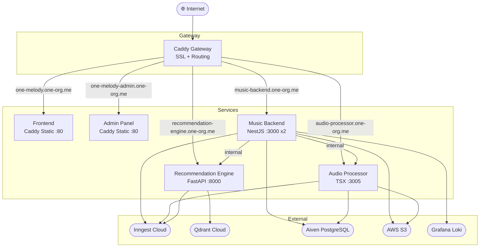

# music-core

Full-stack music platform with audio processing, recommendations, and admin panel — deployed on AWS EC2 using Docker Swarm with Caddy as a reverse proxy.

---

## Architecture



---

## Services

| Service | Stack | Port | Domain |
|---------|-------|------|--------|
| `music-backend` | NestJS + Prisma | 3000 | `music-backend.one-org.me` |
| `audio-processor` | Node.js + TSX + ffmpeg | 3005 | `audio-processor.one-org.me` |
| `recommendation-engine` | Python + FastAPI + PyTorch | 8000 | `recommendation-engine.one-org.me` |
| `frontend` | React/Vite (static) | 80 | `one-melody.one-org.me` |
| `admin` | React/Vite (static) | 80 | `one-melody-admin.one-org.me` |
| `caddy` | Caddy 2 | 80/443 | Gateway + SSL |

---

## Project Structure

```
music-core/
├── music-backend/          # NestJS API server
├── audioProcessingServer/  # Audio processing with ffmpeg
├── reccomendationEngine/   # Python ML recommendation service
├── music-frontend-web/     # React frontend (Vite)
├── music-backend-admin-web/# React admin panel (Vite)
├── Caddyfile               # Caddy reverse proxy config
├── docker-compose.yml      # Docker Swarm stack definition
└── .github/
    └── workflows/
        └── build-docker.yml # GitHub Actions CI
```

---

## Prerequisites

- Docker with Swarm mode
- AWS EC2 instance (m7i-flex.large or similar)
- Domain with DNS A records pointing to EC2 IP
- Docker Hub account

---

## DNS Setup

Add these A records in your DNS provider pointing to your EC2 IP:

| Host | Value |
|------|-------|
| `music-backend` | `YOUR_EC2_IP` |
| `audio-processor` | `YOUR_EC2_IP` |
| `recommendation-engine` | `YOUR_EC2_IP` |
| `one-melody` | `YOUR_EC2_IP` |
| `one-melody-admin` | `YOUR_EC2_IP` |

---

## Environment Variables

Each service requires a `.env` file. Create them manually on the server after cloning.

### `music-backend/.env`
```env
POSTGRESS_DATABASE_HOST=
POSTGRESS_DATABASE_PORT=
POSTGRESS_DATABASE_USER=
POSTGRESS_DATABASE_PASSWORD=
POSTGRESS_DATABASE_NAME=
DATABASE_URL=
AWS_ACCESS_KEY=
AWS_SECRET_KEY=
AWS_TEMP_BUCKET=
AWS_PRODUCTION_BUCKET=
QUADRANT_DB_API_KEY=
QUADRANT_DB_ENDPOINT=
JWT_SECRET=
RECOMMENDATION_ENGINE_URL=http://recommendation-engine:8000
AUDIO_PROCESSOR_URL=http://audio-processor:3005
PORT=3000
NODE_ENV=production
INNGEST_EVENT_KEY=
INNGEST_SIGNING_KEY=
LOKI_HOST=
LOKI_USERNAME=
LOKI_PASSWORD=
OTEL_EXPORTER_OTLP_ENDPOINT=
OTEL_SERVICE_NAME=
```

### `audioProcessingServer/.env`
```env
POSTGRESS_DATABASE_HOST=
POSTGRESS_DATABASE_PORT=
POSTGRESS_DATABASE_USER=
POSTGRESS_DATABASE_PASSWORD=
POSTGRESS_DATABASE_NAME=
DATABASE_URL=
AWS_ACCESS_KEY=
AWS_SECRET_KEY=
AWS_TEMP_BUCKET=
AWS_PRODUCTION_BUCKET=
INNGEST_EVENT_KEY=
INNGEST_SIGNING_KEY=
NODE_ENV=production
INNGEST_DEV=0
```

### `reccomendationEngine/.env`
```env
QUADRANT_DB_API_KEY=
QUADRANT_DB_ENDPOINT=
INNGEST_EVENT_KEY=
INNGEST_SIGNING_KEY=
INNGEST_DEV=0
```

---

## Deployment

### 1. Clone the repo
```bash
git clone https://github.com/karankumar786786/music-core-full.git
cd music-core-full
```

### 2. Create `.env` files
```bash
nano music-backend/.env
nano audioProcessingServer/.env
nano reccomendationEngine/.env
```

### 3. Init Docker Swarm
```bash
docker swarm init --advertise-addr YOUR_EC2_IP
```

### 4. Deploy the stack
```bash
docker stack deploy -c docker-compose.yml music-core
```

### 5. Watch services come up
```bash
watch -n 2 'docker stack services music-core'
```

All services should show `1/1` or `2/2` within a few minutes. Caddy will automatically issue SSL certificates via Let's Encrypt.

---

## CI/CD

GitHub Actions workflow at `.github/workflows/build-docker.yml` builds and pushes Docker images to Docker Hub on manual trigger.

**Trigger:** Actions tab → Build and Push to Docker Hub → Run workflow → select service + version

| Input | Description |
|-------|-------------|
| `service` | `all`, `music-backend`, `audio-processor`, `recommendation-engine`, `frontend`, `admin` |
| `version` | Semantic version e.g. `1.0.0` |

### Required GitHub Secrets

| Secret | Description |
|--------|-------------|
| `DOCKERHUB_USERNAME` | Docker Hub username |
| `DOCKERHUB_TOKEN` | Docker Hub access token |

---

## Useful Commands

```bash
# View all services
docker stack services music-core

# View logs for a service
docker service logs music-core_music-backend -f
docker service logs music-core_caddy -f

# Force update a service (pull latest image)
docker service update --force --image oneorg6969/music-backend:latest music-core_music-backend

# Scale a service
docker service scale music-core_music-backend=3

# Remove the stack
docker stack rm music-core

# Clean up unused images
docker system prune -a -f
```

---

## Internal Communication

Services communicate internally via Docker overlay network (`music-core-network`) using service names as hostnames:

```
music-backend → http://recommendation-engine:8000
music-backend → http://audio-processor:3005
```

Browser/frontend calls always go through the **public domain** since SPAs run in the browser, not on the server.

---

## Tech Stack

- **Infrastructure:** AWS EC2, Docker Swarm, Caddy
- **Backend:** NestJS, Prisma, PostgreSQL (Aiven)
- **Audio:** Node.js, TSX, ffmpeg
- **ML/Recommendations:** Python, FastAPI, PyTorch (CPU), sentence-transformers, Qdrant
- **Frontend:** React, Vite, Caddy (static serving)
- **Events:** Inngest
- **Storage:** AWS S3
- **Observability:** Grafana Loki, OpenTelemetry
- **CI/CD:** GitHub Actions, Docker Hub