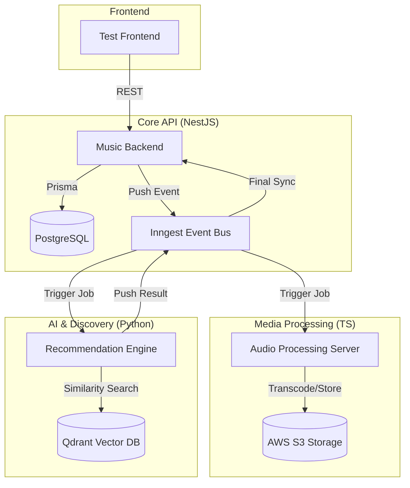

# Music Core: Comprehensive Technical Blueprint

This document provides an exhaustive technical overview of the Music Core ecosystem, detailing everything from high-level architecture to low-level implementation logic.

---

## 1. Project Overview & Folder Structure

The project is structured as a distributed mono-repo containing four main services that cooperate to provide a seamless music streaming and recommendation experience.

### Folder Structure

```text
music-core/
├── music-backend/                # Core NestJS API (The "Brain")
│   ├── prisma/                   # Database schema and migrations
│   ├── src/
│   │   ├── auth/                 # JWT-based authentication
│   │   ├── users/                # User management
│   │   ├── songs/                # Song management & upload triggers
│   │   ├── artists/              # Artist metadata management
│   │   ├── playlists/            # System-wide playlists
│   │   ├── userplaylists/        # User-created playlists
│   │   ├── interaction/          # History, Favourites, Trending logic
│   │   ├── feed/                 # AI-driven personalized feed
│   │   ├── search/               # Two-stage fuzzy search
│   │   ├── lib/
│   │   │   └── helpers/          # Core utilities (S3, Signature, Inngest)
│   │   └── main.ts               # Entry point, Swagger & Inngest setup
├── audioProcessingServer/        # TypeScript/Express Worker (The "Worker")
│   ├── lib/
│   │   ├── audioProcessor/       # FFmpeg transcoding & Sarvam AI transcription
│   │   ├── imageProcessors/      # Sharp-based image optimization
│   │   └── inngest/              # Event handlers for media jobs
│   └── index.ts                  # Worker entry point (Port 3005)
├── reccomendationEngine/         # Python/FastAPI AI Engine (The "Intelligence")
│   ├── main.py                   # Vector embedding & Qdrant recommendation logic
│   ├── processing/               # Python-based signal processing
│   └── pyproject.toml            # Dependencies: SentenceTransformers, Essentia
└── test-frontend/                # Vanilla JS/HTML Testing UI
    ├── index.html
    ├── index.js
    └── index.css
```

---

## 2. System Architecture

The ecosystem operates on an **Event-Driven Distributed Architecture** using **Inngest** for reliable message passing and job orchestration.



---

## 3. Low-Level Implementation Details

### A. Security: HMAC Signed IDs

To prevent ID enumeration and unauthorized data access, the system uses **Signed IDs** via `SignatureUtility`.

- **Logic**: Every UUID is appended with a SHA-256 HMAC signature using a server-side secret.
- **Verification**: The system verifies the signature on every request before proceeding with database lookups.
- **Format**: `[uuid].[hmac_hash]` (e.g., `550e8400-e29b-41d4-a716-446655440000.a1b2c3d4...`)

### B. Two-Stage Search Pipeline

Search is optimized for both speed and precision:

1.  **Stage 1 (Database)**: Uses PostgreSQL `pg_trgm` GIN indices to find potential candidates (Limit: 150).
2.  **Stage 2 (Application)**: A native **Levenshtein Distance** algorithm in TypeScript re-ranks candidates to handle complex typos that trigram indices might miss.

### C. Intelligent Personalization (Weighted Feedback)

The feed isn't just a list of recent songs; it's a personalized experience generated by calculating a **Weighted Centroid** in vector space.

1.  **Weighted Signal Collection**: The Backend gathers user signals with specific intensities:
    - **User Favourites** (Weight: **2.0**): Strongest indication of long-term taste.
    - **User History** (Weight: **1.0**): Captures short-term listening trends.
2.  **Custom Centroid Calculation**: The Python engine fetches the raw 384-dimensional vectors for these signals and performs a weighted average to find the user's "Musical North Star."
3.  **Vector Search**: Instead of a simple recommendation, it performs a high-precision search around this custom centroid, ensuring the feed is dominated by the user's favourites while still providing variety from their recent history.

### D. AI Embedding Logic (The 40-45-15 Rule)

The Recommendation Engine generates a 384-dimensional vector for every song using a weighted combination:

- **40% Lyrics**: Processed via `paraphrase-multilingual-MiniLM-L12-v2` (SentenceTransformer).
- **45% Audio Features**: Extracted via `Essentia` (BPM, Key, Danceability, Energy, Loudness, and 13 MFCC coefficients).
- **15% Metadata**: Title, Artist, and Genre processed via `all-MiniLM-L6-v2`.

### E. Media Processing Pipeline

1.  **Audio**: FFmpeg transcodes uploads to standard `audio.mp3` (128kbps) and generates `original.mp3` for archival. Sarvam AI is used for diarized transcription.
2.  **Images**: Sharp optimizes images into three formats: `original`, `scaled`, and `thumbnail`.
3.  **Persistence**: Final assets are moved from a `temp` bucket to a `production` bucket after successful processing.

---

## 4. Data Model (Prisma)

The system manages complex relationships across several core entities:

- **User**: Handles auth and links to interaction history and playlists.
- **Song**: The primary entity, linked to `Artist`, `Playlist`, and `History`. Includes a `vectorId` for Qdrant lookups.
- **Job Models**: `SongProcessingJob`, `ArtistProcessingJob`, and `PlaylistProcessingJob` track the lifecycle of background tasks (transcoding, embedding, etc.) with retry counters.
- **Interaction History**: Tracks every song a user listens to, creating "Positive Signals" for the AI engine.

---

## 5. Event Pipeline (Inngest)

| Event Name                   | Payload Highlights                         | Logic                                                          |
| :--------------------------- | :----------------------------------------- | :------------------------------------------------------------- |
| `audio-process-job`          | `jobId`, `tempSongKey`, `tempSongImageKey` | Triggers transcoding and image scaling.                        |
| `vector-embedding-job`       | `jobId`, `processedKey`, `metadata`        | Triggers Python engine to download audio and generate vectors. |
| `vector-embedding-completed` | `jobId`, `qdrantPointId`                   | Signals the backend to finalize the song record.               |
| `feed/generate`              | `positiveSignals`, `excludeSongIds`        | Requests a weighted personalized recommendation list.          |

---

## 6. Technical Stack Summary

- **Backend**: NestJS, Prisma, PostgreSQL, Zod, Swagger.
- **Worker**: TypeScript, Express, FFmpeg, Sharp, Sarvam AI SDK.
- **AI**: Python, FastAPI, SentenceTransformers, Essentia, Qdrant Client.
- **Orchestration**: Inngest.
- **Storage**: AWS S3 (Standard & Temp buckets).

---

_This project is a high-performance, AI-native music platform designed for scale and discovery._
